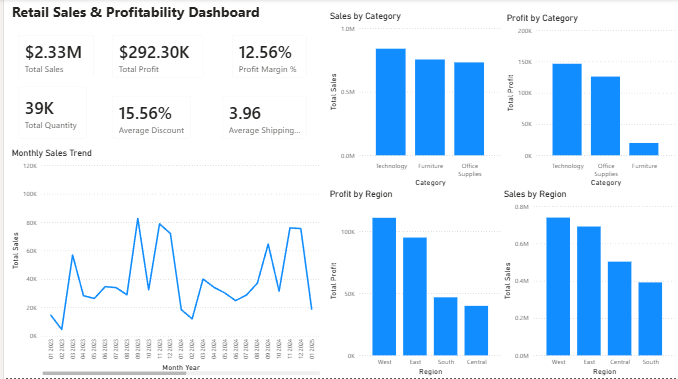
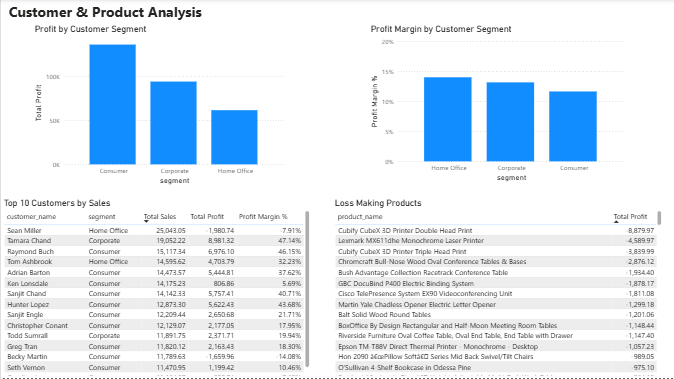
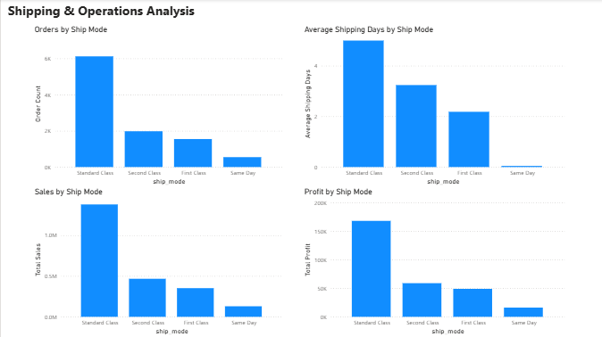

# Retail Data Warehouse & Profitability Analytics

## Project Overview

This project is an end-to-end retail data engineering and analytics project focused on sales performance and profitability analysis.

The goal is to build a cloud-enabled ELT pipeline that stores raw retail sales data in AWS S3, catalogs the data using AWS Glue, ingests it into PostgreSQL, transforms it into analytics-ready warehouse tables, validates data quality, and generates business insights using SQL.

The project follows an ELT approach:

1. Extract raw data from AWS S3
2. Load raw data into PostgreSQL
3. Transform raw data into raw, staging, and mart layers using SQL
4. Validate each data layer
5. Generate business insights from the mart layer
6. Prepare the data model for dashboarding and future orchestration

---

## Business Scenario

A retail company receives raw sales, customer, product, and regional data from business systems. The raw data is not directly ready for analysis.

The business needs a reliable data warehouse that can support analysis of:

* Sales performance
* Profitability
* Product performance
* Regional performance
* Customer segments
* Discount impact
* Shipping mode performance
* Loss-making products

---

## Project Goals

* Store raw retail data in AWS S3 as a cloud raw data lake zone
* Use AWS Glue Crawler and AWS Glue Data Catalog for metadata discovery
* Build a Python ingestion pipeline from AWS S3 to PostgreSQL
* Store raw data in a PostgreSQL raw schema
* Create a staging layer for cleaned and standardized data
* Design a mart layer using fact and dimension tables
* Build a star schema for analytics and reporting
* Add SQL-based validation checks for each layer
* Perform SQL business analysis from the mart layer
* Document the full project for GitHub and interviews
* Prepare the project for future dbt, orchestration, and Power BI dashboarding

---

## Tech Stack

* AWS S3
* AWS Glue Crawler
* AWS Glue Data Catalog
* Python
* boto3
* pandas
* PostgreSQL
* SQL
* Git
* GitHub
* VS Code
* dbt Core
* dbt-postgres

Planned next tools:

* Prefect or Airflow
* Power BI

---

## Architecture

```text
Local CSV Dataset
    ↓
AWS S3 Raw Data Lake
    ↓
AWS Glue Crawler
    ↓
AWS Glue Data Catalog
    ↓
Python S3-to-PostgreSQL Ingestion
    ↓
PostgreSQL Raw Layer
    ↓
PostgreSQL Staging Layer
    ↓
PostgreSQL Mart Layer
    ↓
Business Analysis SQL
    ↓
Power BI Dashboard
```

---

## Data Pipeline Layers

### 1. Raw Layer

The raw layer stores data loaded from AWS S3 with minimal transformation.

Table:

* `raw.superstore_sales`

Purpose:

* Preserve the original source structure
* Store data loaded from AWS S3
* Provide a reliable starting point for downstream transformations

---

### 2. Staging Layer

The staging layer standardizes and prepares raw data for analytics.

Table:

* `staging.stg_superstore_sales`

Key transformations:

* Converted `order_date` from text to date
* Converted `ship_date` from text to date
* Created `shipping_days`
* Created `profit_margin_percentage`
* Prepared clean data for warehouse modeling

---

### 3. Mart Layer

The mart layer organizes the cleaned staging data into a business-ready star schema.

Tables:

* `marts.fact_sales`
* `marts.dim_customer`
* `marts.dim_product`
* `marts.dim_region`
* `marts.dim_date`

The grain of `marts.fact_sales` is one row per sales transaction line.

---

## dbt Transformation Layer

dbt Core was added to manage SQL transformations in a modular and production-style workflow.

The dbt project is located at:

- `dbt/retail_dbt/`

dbt is used to build:

- Staging model: `stg_superstore_sales`
- Dimension models:
  - `dim_customer`
  - `dim_product`
  - `dim_region`
  - `dim_date`
- Fact model:
  - `fact_sales`

dbt features used:

- Source definitions
- Model references using `ref()`
- Source references using `source()`
- Table materializations
- Custom schema macro
- Data tests
- dbt documentation generation

All dbt tests passed successfully:

- 28 tests passed
- 0 failures
- 0 errors

---

## Star Schema Design

The mart layer uses a star schema.

```text
                 dim_customer
                      |
dim_product  —   fact_sales   —  dim_region
                      |
                   dim_date
```

### Fact Table

`marts.fact_sales` stores measurable sales transaction metrics:

* Sales
* Quantity
* Discount
* Profit
* Shipping days
* Profit margin percentage

### Dimension Tables

Dimension tables store descriptive business attributes:

| Table                | Description                                     |
| -------------------- | ----------------------------------------------- |
| `marts.dim_customer` | Customer and segment information                |
| `marts.dim_product`  | Product, category, and sub-category information |
| `marts.dim_region`   | Geographic and regional information             |
| `marts.dim_date`     | Calendar date attributes                        |

---

## Data Validation

Validation was performed at multiple stages of the pipeline.

Validation checks included:

* Row count checks
* Missing value checks
* Duplicate key checks
* Date range checks
* Numeric range checks
* Missing dimension key checks
* Business metric total checks

Validation reports:

* `reports/raw_data_validation_results.md`
* `reports/staging_validation_results.md`
* `reports/mart_validation_results.md`

---

## Key Validation Results

| Layer         | Validation Result |
| ------------- | ----------------- |
| Raw Layer     | Passed            |
| Staging Layer | Passed            |
| Mart Layer    | Passed            |

Important row counts:

| Table                          | Row Count |
| ------------------------------ | --------: |
| `raw.superstore_sales`         |    10,194 |
| `staging.stg_superstore_sales` |    10,194 |
| `marts.fact_sales`             |    10,194 |
| `marts.dim_customer`           |       804 |
| `marts.dim_product`            |     1,862 |
| `marts.dim_region`             |       655 |
| `marts.dim_date`               |     1,464 |

---

## Business Analysis

Business analysis was performed using SQL queries on the mart layer.

Analysis areas included:

* Sales and profit by product category
* Sales and profit by region
* Monthly sales and profit trends
* Top customers by sales
* Loss-making products
* Profit by customer segment
* Shipping mode performance

Business analysis SQL file:

* `sql/07_business_analysis_queries.sql`

Business insight report:

* `reports/business_insights.md`

---

## Key Business Insights

* Technology is the most profitable product category.
* Furniture has high sales but weak profitability.
* West is the strongest region by total profit.
* Central has the weakest regional profit margin.
* Consumer is the largest customer segment by sales and profit.
* Home Office has the highest customer segment profit margin.
* Some high-sales customers generate negative profit.
* Some products generate sales revenue but still create losses.
* Standard Class shipping drives the highest sales and profit.
* Same Day shipping is fastest but has the lowest order volume and profit.

---

## Power BI Dashboard

A Power BI dashboard was created using the PostgreSQL mart layer.

The dashboard connects to the star schema tables:

* `marts.fact_sales`
* `marts.dim_customer`
* `marts.dim_product`
* `marts.dim_region`
* `marts.dim_date`

The dashboard includes three pages:

1. **Retail Sales & Profitability Dashboard**

   * KPI cards for total sales, profit, profit margin, quantity, average discount, and average shipping days
   * Sales and profit by product category
   * Sales and profit by region
   * Monthly sales trend

2. **Customer & Product Analysis**

   * Profit by customer segment
   * Profit margin by customer segment
   * Top 10 customers by sales
   * Top loss-making products

3. **Shipping & Operations Analysis**

   * Orders by ship mode
   * Average shipping days by ship mode
   * Sales by ship mode
   * Profit by ship mode

Dashboard documentation:

* `dashboard/README.md`

### Dashboard Screenshots

#### Retail Sales & Profitability Dashboard



#### Customer & Product Analysis



#### Shipping & Operations Analysis



> Note: The `.pbix` file is stored locally in the `dashboard/` folder but is not committed to GitHub because Power BI files can be large. Dashboard screenshots are included for portfolio review.

---

## SQL Files

| File                                   | Purpose                                   |
| -------------------------------------- | ----------------------------------------- |
| `sql/01_create_raw_tables.sql`         | Creates raw schema and raw sales table    |
| `sql/02_raw_data_validation.sql`       | Validates raw data after ingestion        |
| `sql/03_create_staging_table.sql`      | Creates staging table and transformations |
| `sql/04_staging_data_validation.sql`   | Validates staging layer                   |
| `sql/05_create_mart_tables.sql`        | Creates fact and dimension tables         |
| `sql/06_mart_data_validation.sql`      | Validates mart layer                      |
| `sql/07_business_analysis_queries.sql` | Answers business analysis questions       |

---

## Python Scripts

| File                               | Purpose                                        |
| ---------------------------------- | ---------------------------------------------- |
| `scripts/inspect_dataset.py`       | Inspects the raw dataset structure             |
| `scripts/test_s3_connection.py`    | Tests AWS S3 access using boto3                |
| `scripts/ingest_s3_to_postgres.py` | Loads raw CSV data from AWS S3 into PostgreSQL |

---

## AWS Resources Used

| Resource      | Name                                         |
| ------------- | -------------------------------------------- |
| S3 Bucket     | `retail-data-engineering-project-varun-2026` |
| S3 Raw Path   | `raw/superstore/superstore_sales.csv`        |
| Glue Database | `retail_data_catalog`                        |
| Glue Crawler  | `superstore_raw_data_crawler`                |
| Glue Table    | `raw_superstore`                             |

---

## Project Structure

```text
Retail-Data-Warehouse-Profitability-Analytics/
│
├── data/
│   ├── raw/
│   │   └── superstore_sales.csv
│   ├── processed/
│   └── README.md
│
├── scripts/
│   ├── inspect_dataset.py
│   ├── test_s3_connection.py
│   └── ingest_s3_to_postgres.py
│
├── sql/
│   ├── 01_create_raw_tables.sql
│   ├── 02_raw_data_validation.sql
│   ├── 03_create_staging_table.sql
│   ├── 04_staging_data_validation.sql
│   ├── 05_create_mart_tables.sql
│   ├── 06_mart_data_validation.sql
│   └── 07_business_analysis_queries.sql
│
├── dbt/
│
├── orchestration/
│
├── dashboard/
│   └── README.md
│
├── images/
│
├── docs/
│   ├── architecture.md
│   ├── aws_setup.md
│   ├── business_requirements.md
│   ├── data_model.md
│   └── source_data_profile.md
│
├── reports/
│   ├── raw_data_validation_results.md
│   ├── staging_validation_results.md
│   ├── mart_validation_results.md
│   └── business_insights.md
│
├── requirements.txt
├── README.md
└── .gitignore
```

---

## Current Project Status

Completed:

* Project folder structure
* Git and GitHub setup
* Dataset inspection
* AWS S3 raw data lake setup
* AWS Glue Crawler and Data Catalog setup
* Python S3 connection test
* Python S3-to-PostgreSQL ingestion
* PostgreSQL raw layer
* PostgreSQL staging layer
* PostgreSQL mart layer
* Star schema design
* SQL validation checks
* Business analysis SQL queries
* Business insights report
* Converted SQL transformations into dbt models
* Added dbt tests
* Generated dbt documentation
* Power BI dashboard with three report pages
* Dashboard screenshots added for Github portfolio review

Planned next steps:

* Add orchestration using Prefect or Airflow


---

